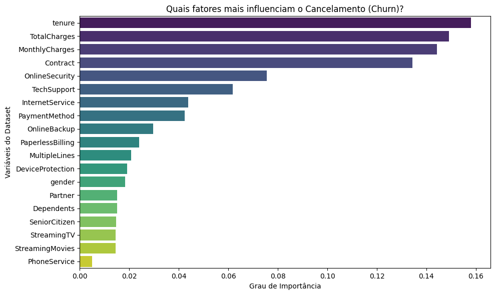

## Insights da análise

Depois do treinamento, analisei a importância das variáveis para entender quais características tiveram maior influência nas previsões do modelo.

Os principais pontos observados foram:

1. **Tipo de contrato:** Clientes com contratos mensais apresentam uma ocorrência maior de churn em comparação com clientes em contratos de maior duração.

2. **Tempo de permanência:** Clientes com pouco tempo de relacionamento com a empresa apresentam maior ocorrência de cancelamento, principalmente nos primeiros meses.

3. **Faturamento e serviços contratados:** O valor da cobrança mensal aparece entre as variáveis relevantes. A relação com serviços adicionais, como suporte técnico e proteção de dispositivo, pode ser explorada para entender melhor o comportamento desses clientes.

