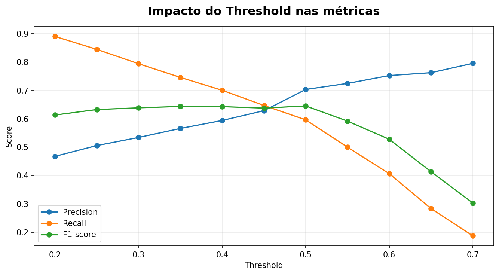
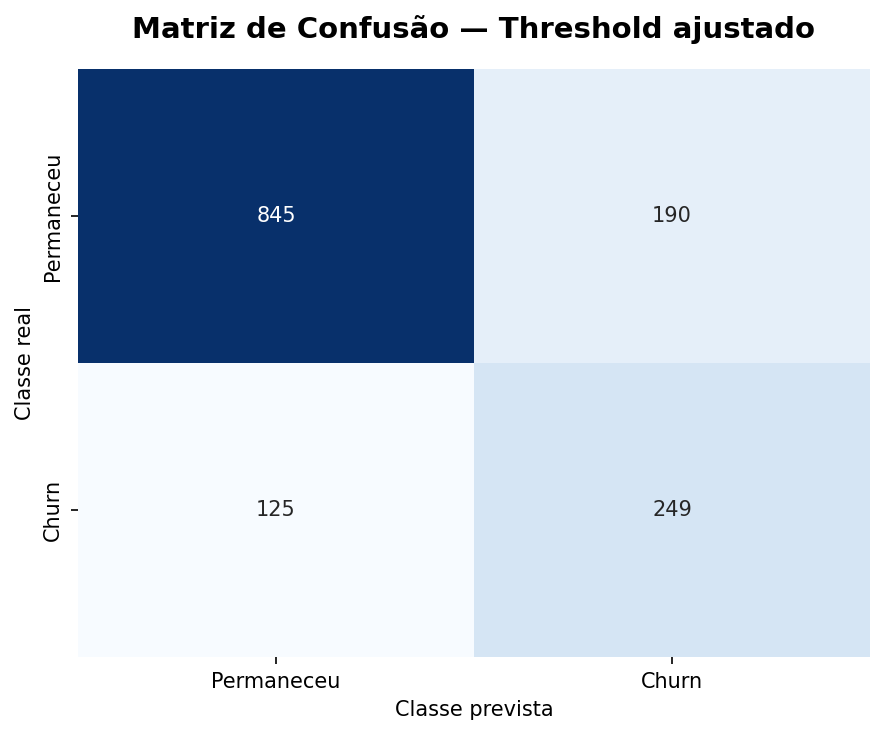

# 📊 Previsão de Churn em Telecom

### Machine Learning aplicado à retenção de clientes

Este projeto analisa o comportamento de clientes de uma empresa de telecomunicações e desenvolve um modelo capaz de identificar clientes com maior probabilidade de cancelamento.

A proposta vai além da previsão: compreender padrões associados ao churn, comparar diferentes abordagens de Machine Learning e transformar os resultados em informações que possam apoiar estratégias de retenção.

---

## 🎯 Contexto do problema

A perda de clientes, conhecida como **churn**, é um dos principais desafios enfrentados por empresas que trabalham com serviços recorrentes.

Identificar antecipadamente clientes com maior risco de cancelamento pode ajudar a direcionar estratégias de retenção e priorizar clientes que exigem maior atenção.

Neste projeto, o problema é resumido pela seguinte pergunta:

> **Quais clientes apresentam maior probabilidade de cancelar o serviço?**

Para responder a essa questão, são analisadas informações relacionadas ao perfil dos clientes, serviços contratados, tipo de contrato, tempo de permanência e valores de cobrança.

---

## 📂 Base de dados

O conjunto de dados utilizado contém:

* **7.043 clientes**
* **21 variáveis**

Entre as informações disponíveis estão características dos clientes, serviços contratados, informações de cobrança e situação de cancelamento.

A variável **`Churn`** é utilizada como variável-alvo e indica se determinado cliente permaneceu ou cancelou o serviço.

---

## 🔎 Principais variáveis analisadas

Algumas das principais variáveis utilizadas são:

* **`tenure`** — quantidade de meses que o cliente permanece na empresa.
* **`Contract`** — tipo de contrato.
* **`MonthlyCharges`** — valor cobrado mensalmente.
* **`TotalCharges`** — total acumulado de cobranças.
* **`PaymentMethod`** — forma de pagamento.
* **`InternetService`** — tipo de serviço de internet contratado.
* **`Churn`** — indica se o cliente cancelou ou permaneceu utilizando o serviço.

---

## 📊 Distribuição do Churn

Na base analisada:

* **5.174 clientes permaneceram**
* **1.869 clientes cancelaram**


A quantidade de clientes que permaneceu é consideravelmente maior do que a quantidade de clientes que cancelou, indicando um desbalanceamento entre as classes.

Por esse motivo, a avaliação dos modelos não foi baseada apenas em acurácia. Também foram consideradas **Precision, Recall, F1-score e ROC-AUC**.

---

## 🧹 Tratamento dos dados

A coluna **`customerID`** foi removida por funcionar apenas como identificador individual do cliente.

A variável **`TotalCharges`**, originalmente armazenada como texto, foi convertida para formato numérico. A conversão revelou **11 valores ausentes**, tratados posteriormente dentro do pipeline.

A variável-alvo **`Churn`** foi transformada para representação numérica:

* `No` → `0`
* `Yes` → `1`

Para reduzir o risco de **data leakage**, o pré-processamento foi integrado ao processo de modelagem utilizando `Pipeline` e `ColumnTransformer`.

As transformações foram ajustadas somente sobre os dados de treinamento.

---

## 📈 Análise exploratória

### Churn por tipo de contrato

Foi analisada a taxa de churn entre os diferentes tipos de contrato.


A análise mostra diferenças na ocorrência de churn entre as modalidades de contrato, indicando uma associação entre essas variáveis.

Esse resultado não deve ser interpretado isoladamente como uma relação causal, mas pode ajudar a identificar grupos que merecem maior atenção em análises de retenção.

---

## 🤖 Estratégia de Machine Learning

Os dados foram divididos em três conjuntos:

* **60% para treinamento**
* **20% para validação**
* **20% para teste**

A proporção de churn foi preservada nos três conjuntos, permanecendo próxima de **26,5%**.

O conjunto de treinamento foi utilizado para ajustar os modelos, o conjunto de validação para analisar diferentes thresholds e o conjunto de teste permaneceu separado para a avaliação final.

Foram comparados dois algoritmos:

### Logistic Regression

Utilizada como **baseline**, fornecendo uma referência relativamente simples e interpretável.

### Random Forest Classifier

Utilizado como segundo modelo para verificar se uma abordagem mais complexa produziria ganhos relevantes.

---

## 📏 Comparação dos modelos

Os modelos foram inicialmente avaliados utilizando o threshold padrão de classificação.

| Modelo              | Accuracy Treino | Accuracy Teste |  Precision |     Recall |   F1-score |    ROC-AUC |
| ------------------- | --------------: | -------------: | ---------: | ---------: | ---------: | ---------: |
| Logistic Regression |          80,45% |     **78,85%** | **61,95%** | **52,67%** | **56,94%** | **83,27%** |
| Random Forest       |          99,83% |         77,86% |     60,76% |     46,79% |     52,87% |     80,63% |

A **Logistic Regression apresentou melhor desempenho no conjunto de teste** nas principais métricas avaliadas.

O Random Forest atingiu **99,83% de acurácia no treinamento**, mas caiu para **77,86% no teste**, indicando forte diferença entre o desempenho nos dados conhecidos e em novos dados.

Esse comportamento sugere **overfitting**.

A comparação demonstra que, neste problema, o aumento da complexidade do modelo não resultou em melhor capacidade de generalização.

Por apresentar maior Recall, além de melhores F1-score e ROC-AUC, a **Logistic Regression foi selecionada para as análises seguintes**.

---

## 🔍 Matriz de confusão

A matriz de confusão permite observar os tipos de acertos e erros produzidos pelo modelo.


No contexto de churn, os **falsos negativos** possuem importância especial.

Eles representam clientes que realmente cancelaram, mas foram classificados pelo modelo como clientes que permaneceriam.

Para uma estratégia de retenção, esse tipo de erro pode representar uma oportunidade perdida de intervenção.

---

## 🎚️ Análise do threshold

O threshold padrão de classificação é **0,50**.

Entretanto, em um problema de churn, utilizar apenas esse valor pode não representar o melhor equilíbrio para o objetivo do negócio.

Foram analisados thresholds entre **0,20 e 0,70** utilizando o conjunto de validação.



A análise mostrou o trade-off entre **Precision e Recall**.

Thresholds menores aumentam a capacidade de identificar clientes que realmente cancelam, mas também aumentam a quantidade de falsos positivos.

Foi definida como referência uma busca por **Recall de pelo menos 70% no conjunto de validação**, selecionando entre os candidatos aquele que apresentasse a maior Precision.

A partir desse critério, o threshold escolhido foi:

> **0,40**

---

## 📊 Resultado final

O modelo selecionado foi novamente avaliado no conjunto de teste utilizando o threshold de **0,40**.

| Métrica       |  Resultado |
| ------------- | ---------: |
| **Accuracy**  |     77,64% |
| **Precision** |     56,72% |
| **Recall**    | **66,58%** |
| **F1-score**  |     61,25% |
| **ROC-AUC**   |     83,27% |

O principal efeito do ajuste foi observado no **Recall**.

Com o threshold padrão de `0,50`, o modelo apresentava Recall de **52,67%**.

Após o ajuste para `0,40`, o Recall passou para **66,58%**, um aumento de aproximadamente **13,9 pontos percentuais**.

Em contrapartida, a Precision caiu de **61,95% para 56,72%**, enquanto a Accuracy passou de **78,85% para 77,64%**.

Esse resultado representa o trade-off esperado: o modelo passou a identificar uma parcela maior dos clientes que efetivamente cancelam, ao custo de gerar mais falsos positivos.

---

## 🔎 Matriz de confusão após ajuste



A matriz final permite observar o comportamento do modelo após a alteração do threshold.

A decisão de aceitar uma redução de Precision em troca de maior Recall está relacionada ao contexto do problema: em uma estratégia de retenção, pode ser mais interessante analisar alguns clientes adicionais do que deixar uma parcela significativa dos clientes que realmente cancelariam passar sem identificação.

---

## 💼 Priorização de clientes

Além da classificação de churn, o projeto utiliza a probabilidade prevista pelo modelo para criar uma estratégia simples de priorização.

Foi construído o seguinte indicador:

> **Score de Prioridade = Probabilidade de Churn × MonthlyCharges**

A ideia é combinar duas informações:

**risco de cancelamento + relevância financeira do cliente**

Dessa forma, um cliente com alta probabilidade de churn e cobrança mensal elevada pode receber maior prioridade para análise.

Nos clientes de maior prioridade encontrados no conjunto de teste, aparecem probabilidades de churn superiores a **80%**, associadas principalmente a contratos mensais e cobranças mensais elevadas.

O score não representa uma decisão automática de oferecer desconto ou realizar alguma ação comercial.

Ele funciona como uma **ferramenta de apoio**, permitindo que uma equipe de retenção tenha uma fila inicial de clientes que podem merecer investigação.

---

## 💡 Principais conclusões

O projeto produziu alguns resultados importantes:

* Um modelo mais complexo não necessariamente apresentou melhor desempenho.
* A Logistic Regression superou o Random Forest nas principais métricas do conjunto de teste.
* O Random Forest apresentou forte diferença entre treino e teste, indicando overfitting.
* A acurácia isoladamente não foi suficiente para avaliar o problema.
* O ajuste do threshold aumentou o Recall de **52,67% para 66,58%**.
* Esse ganho ocorreu com redução de Precision, demonstrando um trade-off relevante para o negócio.
* Probabilidades de churn podem ser combinadas com informações financeiras para apoiar a priorização de clientes.

---

## ⚠️ Limitações e cuidados

Alguns pontos precisam ser considerados na interpretação dos resultados:

* Associações encontradas nos dados não representam necessariamente causalidade.
* O modelo estima risco com base nos padrões presentes na base utilizada.
* Falsos positivos e falsos negativos possuem custos diferentes para o negócio.
* A escolha do threshold depende dos objetivos e custos reais de uma estratégia de retenção.
* O score de priorização utilizado é uma demonstração e precisaria ser validado com informações financeiras e comerciais reais antes de uma aplicação em produção.
* As previsões devem ser utilizadas como apoio à decisão, e não como único critério para ações comerciais.

---

## 🛠️ Tecnologias utilizadas

* Python
* Pandas
* NumPy
* Matplotlib
* Seaborn
* Scikit-learn
* Google Colab
* GitHub

---

## 📁 Arquivos do projeto

```text
telecom_churn_prediction/
│
├── README.md
├── analisechurn.ipynb
├── grafico1.png
├── grafico2.png
├── grafico3.png
├── grafico4.png
└── grafico5.png
```

---

## ✅ Status do projeto

**Projeto concluído.**

Foram realizadas as etapas de:

1. Compreensão e tratamento dos dados
2. Análise exploratória
3. Separação entre treinamento, validação e teste
4. Construção de pipeline de pré-processamento
5. Treinamento de um modelo baseline
6. Treinamento e comparação com Random Forest
7. Avaliação utilizando diferentes métricas
8. Análise de matriz de confusão
9. Análise e ajuste do threshold
10. Avaliação final em dados de teste
11. Construção de uma estratégia de priorização de clientes

---

## 🎯 Conclusão

A comparação mostrou que a **Logistic Regression apresentou melhor capacidade de generalização que o Random Forest** neste conjunto de dados.

Embora o Random Forest tenha alcançado desempenho quase perfeito nos dados de treinamento, essa vantagem não se manteve no conjunto de teste.

Como falsos negativos representam clientes em risco que deixam de ser identificados, o threshold da Logistic Regression foi ajustado de **0,50 para 0,40**.

Com essa alteração, o modelo alcançou **66,58% de Recall**, mantendo **77,64% de Accuracy** e **83,27% de ROC-AUC** no conjunto de teste.

O resultado demonstra que a escolha de um modelo não depende apenas de sua acurácia ou complexidade. É necessário considerar **capacidade de generalização, tipos de erro e objetivos do negócio**.

Por fim, as probabilidades produzidas pelo modelo foram utilizadas para criar uma estratégia simples de priorização, demonstrando como Machine Learning pode transformar dados de clientes em informações úteis para apoiar decisões relacionadas à retenção.
