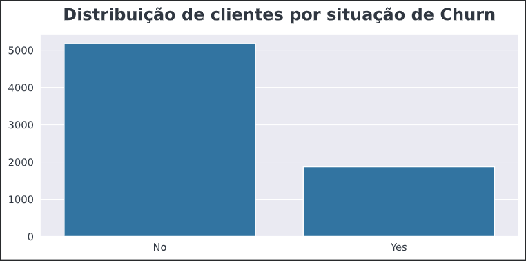
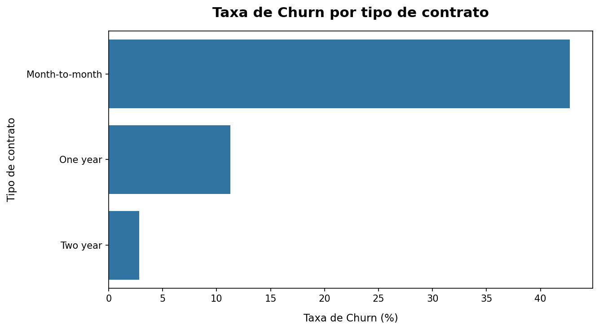

# 📊 Previsão de Churn em Telecom

### Machine Learning aplicado à retenção de clientes

Este projeto tem como objetivo analisar o comportamento de clientes de uma empresa de telecomunicações e desenvolver um modelo capaz de identificar clientes com maior probabilidade de cancelamento.

A proposta é ir além da previsão: compreender quais características estão relacionadas ao churn e transformar essas informações em apoio para estratégias de retenção.

---

## 🎯 Contexto do problema

A perda de clientes, conhecida como **churn**, é um dos principais desafios enfrentados por empresas que trabalham com serviços recorrentes, como as operadoras de telecomunicações.

Conquistar novos clientes normalmente exige investimentos em aquisição, enquanto identificar antecipadamente clientes com maior risco de cancelamento pode ajudar a empresa a direcionar melhor suas estratégias de retenção.

Neste projeto, o problema pode ser resumido pela seguinte pergunta:

> **Quais clientes apresentam maior probabilidade de cancelar o serviço?**

Para responder a essa questão, são analisadas informações relacionadas ao perfil dos clientes, serviços contratados, tipo de contrato, tempo de permanência e valores de cobrança.

---

## 📂 Base de dados

O conjunto de dados utilizado contém informações de clientes de uma empresa de telecomunicações.

A base possui:

* **7.043 clientes**
* **21 variáveis**

Entre as informações disponíveis estão características dos clientes, serviços contratados, informações de cobrança e situação de cancelamento.

A variável **`Churn`** é utilizada como variável-alvo do projeto e indica se determinado cliente permaneceu ou cancelou o serviço.

---

## 🔎 Principais variáveis analisadas

Antes da construção do modelo, é importante compreender o significado das informações disponíveis na base.

Algumas das principais variáveis utilizadas no projeto são:

* **`tenure`** — representa há quantos meses o cliente está na empresa.
* **`Contract`** — indica o tipo de contrato do cliente.
* **`MonthlyCharges`** — representa o valor cobrado mensalmente.
* **`TotalCharges`** — representa o total acumulado de cobranças.
* **`PaymentMethod`** — indica a forma utilizada para pagamento.
* **`InternetService`** — identifica o tipo de serviço de internet contratado.
* **`Churn`** — indica se o cliente cancelou ou permaneceu utilizando o serviço.

---

## 📊 Distribuição do Churn

Antes da modelagem, foi analisada a distribuição da variável-alvo.

Na base utilizada:

* **5.174 clientes permaneceram**
* **1.869 clientes cancelaram o serviço**



A distribuição mostra que a quantidade de clientes que permaneceu na empresa é consideravelmente maior do que a quantidade de clientes que cancelou.

Isso significa que as classes não estão perfeitamente equilibradas.

Essa característica precisa ser considerada durante a avaliação do modelo, pois um modelo pode apresentar uma boa **acurácia** simplesmente por acertar com maior frequência a classe predominante.

Por esse motivo, a avaliação de um modelo de churn não deve depender apenas da acurácia. Métricas como **Precision, Recall, F1-score e ROC-AUC** também são importantes para compreender sua capacidade de identificar clientes que realmente cancelam.

---

## 🧹 Tratamento inicial dos dados

Antes da modelagem, algumas informações precisam ser preparadas.

A coluna **`customerID`** é removida porque funciona apenas como identificador individual do cliente e não possui utilidade direta para a previsão.

A variável **`TotalCharges`** também exige tratamento, pois originalmente está armazenada como texto. Ela é convertida para formato numérico para permitir sua utilização durante a análise e modelagem.

A variável-alvo **`Churn`** é transformada para representação numérica:

* `No` → `0`
* `Yes` → `1`

O tratamento das variáveis preditoras deve ser realizado de forma cuidadosa para evitar **data leakage**, impedindo que informações do conjunto utilizado para avaliação influenciem indevidamente o processo de treinamento.

---

## 📈 Análise exploratória

Antes do treinamento do modelo, são analisadas algumas relações entre as características dos clientes e o churn.

O objetivo desta etapa é identificar padrões presentes na base que possam ajudar a compreender melhor o comportamento dos clientes.

Os padrões observados representam **associações encontradas nos dados** e não devem ser interpretados automaticamente como relações de causa e efeito.

### 📄 Churn por tipo de contrato

O tipo de contrato pode estar relacionado ao nível de compromisso do cliente com a empresa.

Para investigar essa relação, foi calculada a **taxa de churn para cada tipo de contrato**, permitindo comparar a proporção de cancelamentos entre os diferentes grupos.



A comparação permite identificar quais modalidades de contrato apresentam maior proporção de cancelamentos dentro da base analisada.

Esse tipo de informação pode ajudar a orientar análises mais aprofundadas e possíveis estratégias de retenção direcionadas a grupos que apresentam maior ocorrência de churn.

É importante destacar que o gráfico apresenta uma **associação entre contrato e churn**. Ele não demonstra, isoladamente, que o tipo de contrato seja a causa do cancelamento.

---

## 🤖 Estratégia de Machine Learning

O objetivo das próximas etapas é utilizar as informações disponíveis para construir um modelo de classificação capaz de estimar o risco de churn.

O desenvolvimento considera etapas como:

1. Separação entre variáveis preditoras e variável-alvo
2. Divisão dos dados entre treinamento e teste
3. Tratamento das variáveis numéricas e categóricas
4. Construção de um pipeline de pré-processamento
5. Treinamento do modelo
6. Avaliação em dados não utilizados durante o treinamento

Essa estrutura permite construir um processo de modelagem mais próximo de uma aplicação real de Machine Learning.

---

## 🌳 Modelo

O algoritmo escolhido para o projeto é o **Random Forest Classifier**.

O Random Forest combina diversas árvores de decisão para realizar as previsões e consegue trabalhar com relações não lineares entre as características dos clientes.

O pré-processamento e o modelo são estruturados utilizando recursos do **Scikit-learn**, incluindo `Pipeline` e `ColumnTransformer`.

Essa abordagem permite manter as etapas de transformação e modelagem organizadas em um único fluxo e ajuda a reduzir o risco de vazamento de informações entre os dados de treinamento e teste.

---

## 📏 Métricas de avaliação

Como existe diferença entre a quantidade de clientes que permanecem e os que cancelam, a avaliação do modelo deve considerar diferentes métricas.

### Accuracy

Representa a proporção total de previsões corretas.

### Precision

Entre os clientes classificados pelo modelo como churn, indica quantos realmente cancelaram.

### Recall

Entre todos os clientes que realmente cancelaram, indica quantos foram identificados corretamente pelo modelo.

### F1-score

Combina Precision e Recall em uma única métrica.

### ROC-AUC

Avalia a capacidade do modelo de distinguir clientes que cancelam daqueles que permanecem.

Em um cenário de retenção, o **Recall possui importância especial**, pois um falso negativo representa um cliente que realmente cancelaria, mas que não foi identificado pelo modelo como cliente de risco.

---

## 💼 Aplicação no negócio

O modelo pode ser utilizado como ferramenta de apoio para identificar clientes com maior risco de cancelamento.

Um possível fluxo de utilização seria:

```text
Dados do cliente
       ↓
Modelo de Machine Learning
       ↓
Probabilidade de churn
       ↓
Priorização de clientes
       ↓
Análise do perfil
       ↓
Possível estratégia de retenção
```

A previsão não deve ser utilizada como único critério para determinar uma ação comercial.

O objetivo é utilizar o modelo como **ferramenta de apoio à decisão**, permitindo que equipes responsáveis pela retenção priorizem clientes que apresentam maior risco e investiguem quais ações são mais adequadas para cada situação.

---

## ⚠️ Cuidados considerados no projeto

Durante o desenvolvimento, alguns pontos são especialmente importantes:

* Evitar **data leakage** durante o pré-processamento
* Separar os dados de treinamento e teste antes do ajuste das transformações
* Avaliar o modelo utilizando diferentes métricas
* Não utilizar apenas a acurácia como medida de desempenho
* Dar atenção especial ao Recall no contexto de churn
* Interpretar associações encontradas nos dados sem assumir causalidade
* Utilizar as previsões como apoio às decisões de negócio

---

## 🛠️ Tecnologias utilizadas

* Python
* Pandas
* NumPy
* Matplotlib
* Seaborn
* Scikit-learn
* Google Colab
* GitHub

---

## 📁 Arquivos do projeto

```text
telecom_churn_prediction/
│
├── README.md
├── analisechurn.ipynb
├── grafico1.png
└── grafico2.png
```

---

## 🚧 Status do projeto

**Em desenvolvimento.**

Até o momento, foram realizadas as etapas de:

* Carregamento e inspeção dos dados
* Compreensão das principais variáveis
* Análise da distribuição do churn
* Tratamento inicial dos dados
* Análise exploratória
* Análise da taxa de churn por tipo de contrato

As próximas etapas incluem a continuidade da preparação dos dados para Machine Learning, treinamento do modelo e avaliação dos resultados.

---

## 🎯 Objetivo final

Ao final do projeto, o objetivo é obter um modelo capaz de identificar clientes com maior risco de churn e utilizar seus resultados para apoiar decisões relacionadas à retenção.

Mais do que obter uma boa métrica de desempenho, o projeto busca demonstrar como **análise de dados, Machine Learning e visão de negócio** podem ser utilizados em conjunto para transformar dados de clientes em informações úteis para tomada de decisão.
