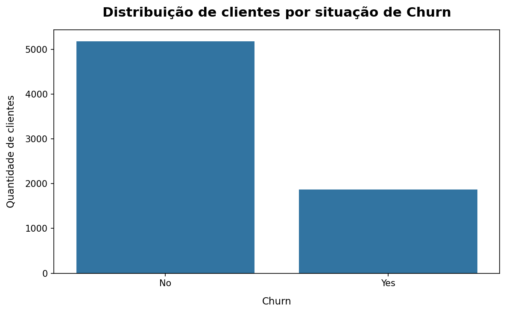

# 📊 Previsão de Churn em Telecom

### Machine Learning aplicado à retenção de clientes

Este projeto tem como objetivo analisar o comportamento de clientes de uma empresa de telecomunicações e desenvolver modelos capazes de identificar clientes com maior probabilidade de cancelamento.

A proposta é ir além da previsão: compreender quais características estão associadas ao churn, avaliar diferentes abordagens de Machine Learning e transformar os resultados em informações que possam apoiar estratégias de retenção.

---

## 🎯 Contexto do problema

A perda de clientes, conhecida como **churn**, é um dos principais desafios enfrentados por empresas que trabalham com serviços recorrentes, como as operadoras de telecomunicações.

Conquistar novos clientes normalmente exige investimentos em aquisição, enquanto identificar antecipadamente clientes com maior risco de cancelamento pode ajudar a empresa a direcionar melhor seus esforços de retenção.

Neste projeto, o problema pode ser resumido pela seguinte pergunta:

> **Quais clientes apresentam maior probabilidade de cancelar o serviço?**

Para responder a essa questão, são analisadas informações relacionadas ao perfil dos clientes, serviços contratados, tipo de contrato, tempo de permanência e valores de cobrança.

---

## 📂 Base de dados

O conjunto de dados utilizado contém informações de clientes de uma empresa de telecomunicações.

A base possui:

* **7.043 clientes**
* **21 variáveis**

Entre as informações disponíveis estão características dos clientes, serviços contratados, informações de cobrança e situação de cancelamento.

A variável **`Churn`** é utilizada como variável-alvo e indica se determinado cliente permaneceu ou cancelou o serviço.

---

## 🔎 Principais variáveis analisadas

Algumas das principais variáveis utilizadas no projeto são:

* **`tenure`** — representa há quantos meses o cliente está na empresa.
* **`Contract`** — indica o tipo de contrato do cliente.
* **`MonthlyCharges`** — representa o valor cobrado mensalmente.
* **`TotalCharges`** — representa o total acumulado de cobranças.
* **`PaymentMethod`** — indica a forma utilizada para pagamento.
* **`InternetService`** — identifica o tipo de serviço de internet contratado.
* **`Churn`** — indica se o cliente cancelou ou permaneceu utilizando o serviço.

---

## 📊 Distribuição do Churn

Antes da modelagem, foi analisada a distribuição da variável-alvo.

Na base utilizada:

* **5.174 clientes permaneceram**
* **1.869 clientes cancelaram o serviço**



A distribuição mostra que a quantidade de clientes que permaneceu na empresa é consideravelmente maior do que a quantidade de clientes que cancelou.

Isso significa que as classes não estão perfeitamente equilibradas.

Essa característica precisa ser considerada durante a avaliação dos modelos, pois uma boa **acurácia** pode ser obtida simplesmente pelo maior número de acertos na classe predominante.

Por esse motivo, a avaliação não será baseada apenas em acurácia. Métricas como **Precision, Recall, F1-score e ROC-AUC** também serão consideradas.

---

## 🧹 Tratamento dos dados

Antes da modelagem, algumas informações precisam ser preparadas.

A coluna **`customerID`** é removida porque funciona apenas como identificador individual do cliente e não possui utilidade direta para a previsão.

A variável **`TotalCharges`** originalmente está armazenada como texto e precisa ser convertida para formato numérico.

A variável-alvo **`Churn`** é transformada para representação numérica:

* `No` → `0`
* `Yes` → `1`

O tratamento das variáveis preditoras será integrado ao processo de modelagem utilizando **Pipeline** e **ColumnTransformer**.

Essa abordagem permite que as transformações sejam ajustadas utilizando apenas os dados de treinamento, reduzindo o risco de **data leakage**.

---

## 📈 Análise exploratória

Antes do treinamento dos modelos, são analisadas relações entre as características dos clientes e o churn.

O objetivo é identificar padrões presentes na base que possam ajudar a compreender o comportamento dos clientes.

Os padrões observados representam **associações encontradas nos dados** e não devem ser interpretados automaticamente como relações de causa e efeito.

### 📄 Churn por tipo de contrato

O tipo de contrato pode estar associado ao nível de compromisso do cliente com a empresa.

Para investigar essa relação, foi calculada a **taxa de churn para cada tipo de contrato**, permitindo comparar a proporção de cancelamentos entre os diferentes grupos.


A comparação permite identificar quais modalidades apresentam maior proporção de cancelamentos dentro da base analisada.

Essa informação pode ajudar a orientar análises posteriores e estratégias de retenção direcionadas a diferentes perfis de clientes.

O resultado demonstra uma **associação entre contrato e churn**, mas não permite concluir, isoladamente, que o tipo de contrato seja a causa do cancelamento.

---

## 🤖 Estratégia de Machine Learning

A modelagem será realizada a partir da separação dos dados entre **treinamento e teste**, mantendo o conjunto de teste fora do processo de ajuste do modelo.

Serão avaliados dois modelos:

### Logistic Regression

A **Logistic Regression** será utilizada como baseline.

O objetivo é estabelecer uma referência de desempenho utilizando um modelo relativamente simples e interpretável.

### Random Forest Classifier

O **Random Forest Classifier** será utilizado como segundo modelo.

Por combinar diversas árvores de decisão, o algoritmo consegue representar relações mais complexas e não lineares entre as características dos clientes.

A comparação permitirá avaliar se o aumento de complexidade do Random Forest produz ganhos relevantes em relação ao baseline.

---

## 📏 Avaliação dos modelos

Os modelos serão avaliados tanto nos dados de **treinamento** quanto nos dados de **teste**.

Essa comparação é importante para identificar situações em que um modelo apresenta desempenho muito elevado nos dados utilizados durante o treinamento, mas perde capacidade de generalização diante de novos dados.

As principais métricas consideradas serão:

* **Accuracy** — proporção total de previsões corretas.
* **Precision** — entre os clientes classificados como churn, quantos realmente cancelaram.
* **Recall** — entre todos os clientes que realmente cancelaram, quantos foram identificados pelo modelo.
* **F1-score** — equilíbrio entre Precision e Recall.
* **ROC-AUC** — capacidade do modelo de distinguir clientes que cancelam daqueles que permanecem.

Em um cenário de retenção, o **Recall possui importância especial**.

Um falso negativo representa um cliente que realmente cancelaria, mas que não foi identificado pelo modelo como cliente de risco.

---

## 🔍 Matriz de confusão

Além das métricas gerais, será utilizada uma **matriz de confusão** para analisar os tipos de acertos e erros produzidos pelo modelo.

Ela permitirá visualizar:

* Clientes corretamente identificados como permanência
* Clientes corretamente identificados como churn
* Falsos positivos
* Falsos negativos

Essa análise é especialmente importante porque diferentes tipos de erro podem gerar impactos diferentes para o negócio.

---

## 🎚️ Análise do threshold

A classificação de churn depende de um limite de probabilidade utilizado para transformar a previsão do modelo em uma decisão de classe.

Em vez de considerar apenas o threshold padrão, serão avaliados diferentes valores para observar o impacto sobre **Precision e Recall**.

Reduzir o threshold pode permitir que mais clientes que realmente cancelariam sejam identificados, aumentando o Recall, mas também pode gerar mais falsos positivos.

A escolha adequada representa, portanto, um equilíbrio entre **capacidade de identificação e custo das ações de retenção**.

---

## 💼 Aplicação no negócio

A probabilidade de churn pode ser utilizada como uma ferramenta de priorização, e não apenas como uma classificação entre clientes que irão ou não cancelar.

Um possível fluxo de utilização seria:

```text
Dados do cliente
       ↓
Modelo de Machine Learning
       ↓
Probabilidade de churn
       ↓
Perfil e valor do cliente
       ↓
Priorização
       ↓
Estratégia de retenção
```

Uma possibilidade é combinar o **risco estimado de churn** com informações relacionadas ao valor do cliente, como `MonthlyCharges`.

Dessa forma, clientes com maior risco de cancelamento e maior relevância financeira podem receber prioridade na análise das equipes responsáveis pela retenção.

A previsão não deve ser utilizada como único critério para determinar uma ação comercial.

O objetivo é transformar o modelo em uma **ferramenta de apoio à decisão**.

---

## 🧠 Interpretação dos resultados

Ao final da modelagem, a análise buscará responder três questões principais:

**1. Qual modelo apresentou melhor capacidade de identificar churn?**

O desempenho da Logistic Regression será comparado ao Random Forest para verificar se o modelo mais complexo oferece ganhos relevantes.

**2. Quais erros são mais importantes para o negócio?**

A análise de falsos positivos e falsos negativos permitirá avaliar o impacto das previsões incorretas.

**3. Como transformar a probabilidade de churn em uma ação?**

A análise de threshold e a priorização dos clientes permitirão aproximar a previsão do modelo de uma possível estratégia de retenção.

A conclusão final será baseada nos resultados efetivamente obtidos durante a modelagem.

---

## ⚠️ Cuidados considerados no projeto

Durante o desenvolvimento, alguns pontos são especialmente importantes:

* Evitar **data leakage** durante o pré-processamento
* Manter os dados de teste fora do ajuste das transformações e dos modelos
* Comparar desempenho entre treino e teste
* Utilizar um modelo baseline antes de avaliar abordagens mais complexas
* Não utilizar apenas acurácia como medida de desempenho
* Dar atenção especial ao Recall no contexto de churn
* Avaliar o impacto de diferentes thresholds
* Interpretar associações sem assumir causalidade
* Utilizar as previsões como apoio às decisões de negócio

---

## 🛠️ Tecnologias utilizadas

* Python
* Pandas
* NumPy
* Matplotlib
* Seaborn
* Scikit-learn
* Google Colab
* GitHub

---

## 📁 Arquivos do projeto

```text
telecom_churn_prediction/
│
├── README.md
├── analisechurn.ipynb
├── gafico1.png
└── grafico2.png
```

---

## 🚧 Status do projeto

**Em desenvolvimento — etapa de modelagem.**

Até o momento, foram realizadas:

* Inspeção e compreensão dos dados
* Análise da distribuição do churn
* Tratamento inicial
* Análise exploratória
* Análise da taxa de churn por tipo de contrato
* Definição da estratégia de modelagem

As etapas finais serão:

1. Implementação do pipeline de pré-processamento
2. Treinamento da Logistic Regression como baseline
3. Treinamento do Random Forest
4. Comparação entre treino e teste
5. Avaliação da matriz de confusão
6. Análise de diferentes thresholds
7. Definição de uma estratégia de priorização de clientes
8. Conclusão dos resultados

---

## 🎯 Objetivo final

O objetivo final é construir uma solução capaz de identificar clientes com maior risco de churn e transformar essa previsão em informação útil para tomada de decisão.

Mais do que buscar o modelo com a maior métrica isolada, o projeto pretende avaliar o equilíbrio entre **desempenho preditivo, tipos de erro e impacto no negócio**.

A análise final deverá permitir uma conclusão semelhante à seguinte estrutura:

> **O modelo A apresentou determinado comportamento em relação ao baseline. O modelo B apresentou ganhos ou perdas em métricas relevantes para o problema. Considerando que falsos negativos possuem impacto importante em estratégias de retenção, foram analisados diferentes thresholds e, a partir dos resultados, construída uma estratégia de priorização de clientes.**

Os valores e conclusões definitivas serão adicionados somente após a execução e avaliação dos modelos.
